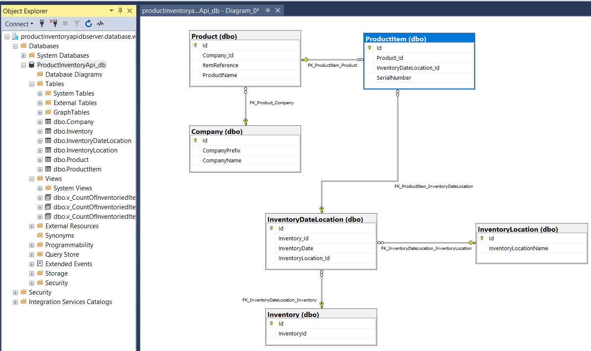
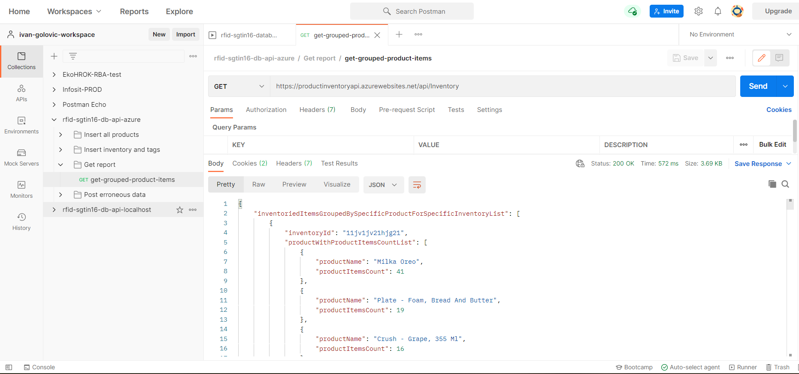

# rfid-sgtin96-database-api

**High-level overview**   

This RESTful web API application receives company and product data using JSON as format, while product items are encoded using RFID and SGTIN-96 standards, it parses the data and stores it in SQL database, it gives reports on product item count for product items stored in SQL database.
Product items are received in JSON requests in form of hexadecimal RFID tags that contain SGTIN-96 encoded product items. Items are parsed and inserted into database and related to company and product. 
Technology used is .NET framework 5. Backend server-side C# code in form of web API methods handles POST and GET requests.
POST handler methods parse received data and populate (insert/update) records into Sql Server or Azure SQL database. 
GET handler method returns report with counts of number of product items grouped by several conditions. 
In backend there is a normalized SQL database in which verified data is written. Project contains both Sql Server and Azure SQL database creation scripts and can be run completely on-premise in IIS or it can be deployed to Azure and use Azure SQL.
   
   
**General description of workflow**

Web application receives data in form of JSON and deserializes it into classes. Since product and company data is only inserted, this data is only checked to see if it already exists in database. If it doesn't already exist in database it is inserted.

For inventory, in implemented data model single inventory can have more than one date and more than one location. This situation is handled by having a normalized relational data model which supports this relationship. 
Processing of POST inventory request: 
- it is determined if inventory location specified in data exists, if it doesn't it is inserted to database 
- it is determined if inventory with inventory-identifier specified in data exists, if it doesn't it is inserted to database
- it is determined if inventory with inventory-date-location specified in data exists:
    - if it doesn't this request is treated as insert of new inventory-date-location and product item records (parsed from RFID tags)
    - if it does this request is treated as update of existing inventory-date-location and product item records (parsed from RFID tags). Product items decoded from request are treated as "new" data while product items already existing in database are treated as "old" data:
      - product items decoded from request that don't exist in database are inserted into database
      - product items that exist in database but don't exist in product items decoded from request are deleted from database
   
   
**Web API controllers and method descriptions**

Web API methods are:
- in controller Product: 
  - POST method to insert: 
    - company records (including company-prefix) into table Company
    - product records (including item-reference) into table Product
- in controller Inventory:  
  - POST method to insert or update: 
    - inventory-location records into table InventoryLocation
    - inventory records into table Inventory
    - inventory-date-location into InventoryDateLocation
    - product item records into ProductItem - records are parsed from RFID hexadecimal tags with SGTIN-96 encoded data (company-prefix, item-reference, serial number of product item)
  - GET method to return report with product item counts grouped by several conditions 
   
   
**Relational database model**

Database contains tables used to store received data and helps enforce business logic through unique keys. Referential integrity is kept using foreign keys. Views are used in reports.
Project contains both Sql Server and Azure SQL database definition SQL script so that database can be created on both platforms.

   
   
**Testing**

For testing of web API methods Postman scripts are available (in two version, one with localhost URLs, other with Azure URL):
- 100 POST requests that result in adding of company and product record
- POST request with 1000 RFID tags with encoded SGTIN-96 data translated into product items and related in database with existing company and product (most tags are corect and few are erroneous)
- GET request to retrieve report
- few defective POST request to test error reporting

There is a unit test that tests parser that parses hexadecimal RFID tags as SGTIN-96 binary representation and retrieves product item data.

Swagger interface exists and can be reached through /swagger/index.html URL, e.g. https://localhost:44303/swagger/index.html or in Azure https://<app_service_name>.azurewebsites.net/swagger/index.html
   
**Setup, configuration and testing of project with on-premise Sql Server**

- get source code from GIT branch azure, restore nuget packages, build solution
- remove eventual Azure publish changes that might come in a way of using local Sql Server instance (currently main branch is modified to deploy to Azure)
- in Sql Server Mnagement Studio run SQL script to create database named "ProductInventoryApi_db" and database objects in Sql Server
- adjust connection strings in appsettings.json files in project
- into Postman application insert request collection JSON file for localhost available in project
- in Postman run prepared requests that populate database data
   
   
**Setup, configuration and testing of project in Azure**

- get source code from GIT branch azure, restore nuget packages, build solution
- in Azure create App Service and Azure SQL server and database wih same name as in project
- create database named "ProductInventoryApi_db" through user interface
- on database "ProductInventoryApi_db" run SQL script to create database objects in Azure SQL
- run Publish and create connection strings and setup Key Vault on Azure to store connecion strings safely
- into Postman application insert request collection JSON file for Azure available in project
- in Postman run prepared requests that populate database data

Postman with imported request collections for testing on Azure:

